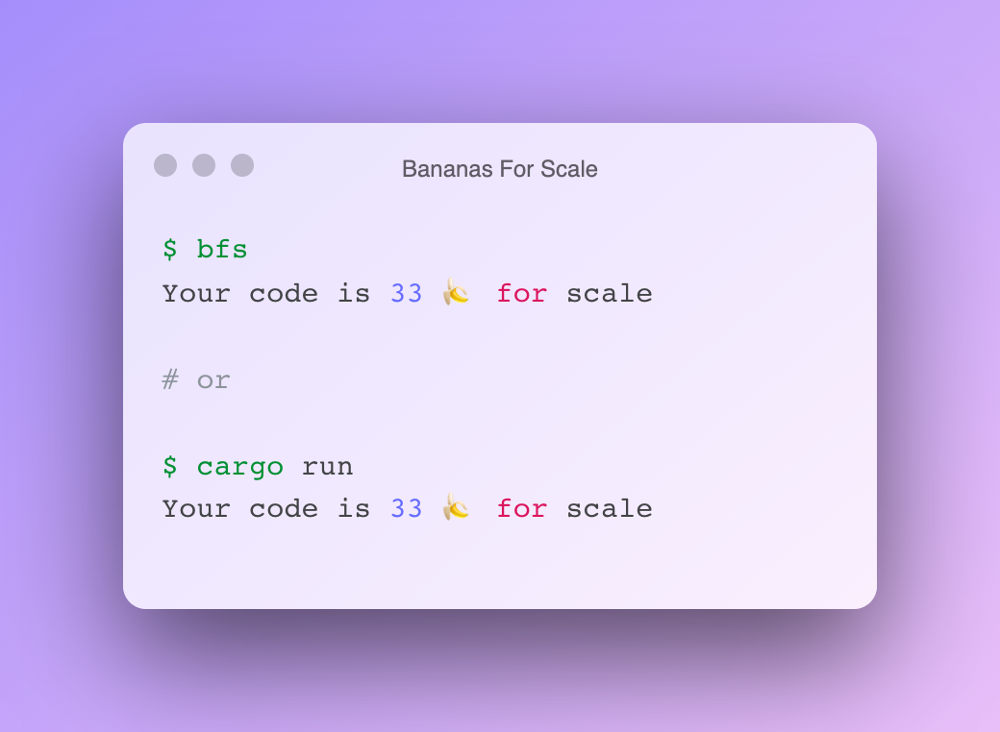

# bfs - Bananas For Scale

Taking in the spirit of the Banana For Scale meme, we count lines of code in bananas.

# Example

## Assumptions

- we assume a banana size of 177.8 millimetres
- we assume a 10pt font on the Pica system - that's roughly 3.51 millimetres
- we assume that line spacing is 0.702 millimetres (10/12 ratio)

Therefore, 1 line of code is 3.51 millimetres + 0.702 millimetres = 4.212 millimetres.

# References
- https://www.dailydot.com/unclick/banana-for-scale-meme-history/
- https://www.reddit.com/r/BananasForScale/
